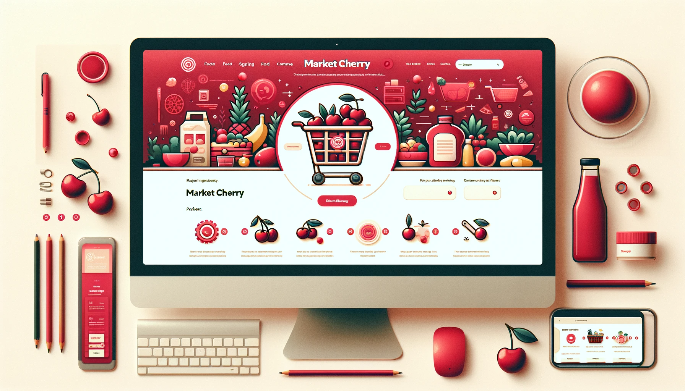

# CherryMarket-BE

## 🔎 서비스 개요

**🍒체리 마켓🍒**은 다양한 식품을 온라인으로 쉽게 구매할 수 있는 e-Commerce 웹 서비스입니다.

고객들은 맛과 품질에 중점을 둔 광범위한 식품 선택을 통해 쇼핑할 수 있으며, 키워드 검색 기능을 통해 원하는 상품을 빠르게 찾을 수 있습니다.

["CherryMarket" 프론트엔드 Repository 보기](https://github.com/SeongHo5/CherryMarket-FE)

["CherryMarket" API 문서 보기](https://app.gitbook.com/o/TNBcX6l2BZaEI1edsewh/s/kNT5qahMOhsyWOaZgLfw/)

---

## 👥 팀원 소개

## 📅 프로젝트 일정

- MVP: 2023.11.30 ~ 2023.12.18

---

## 🔧 기술 스택

### 🔧Front-End
   
 

### 🔧 Back-End
        

### 🛠 DevOps
   

### 📚 Project Management
 
  

