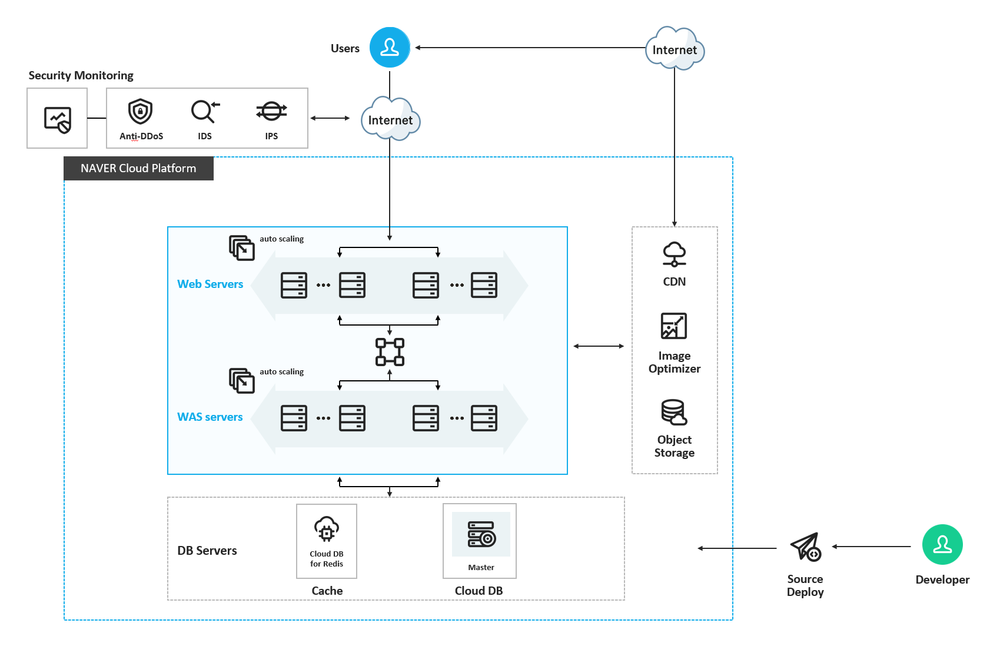
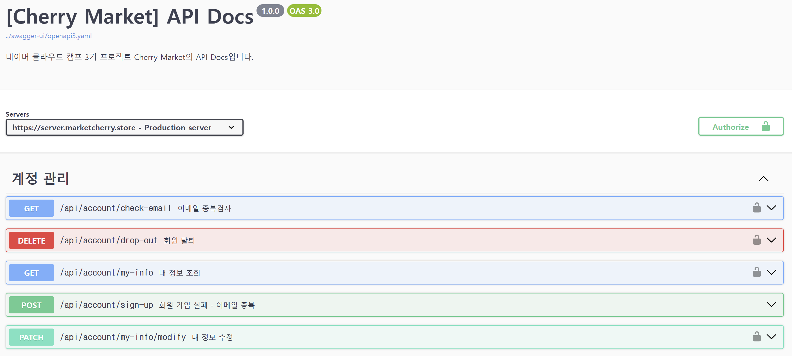
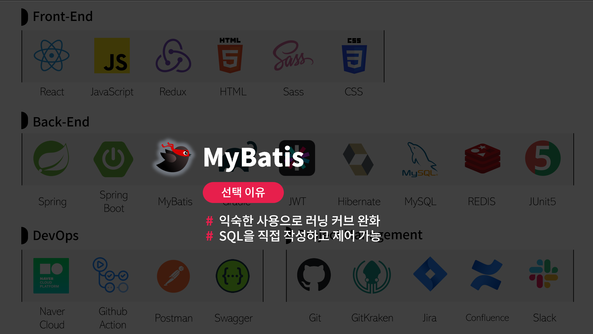
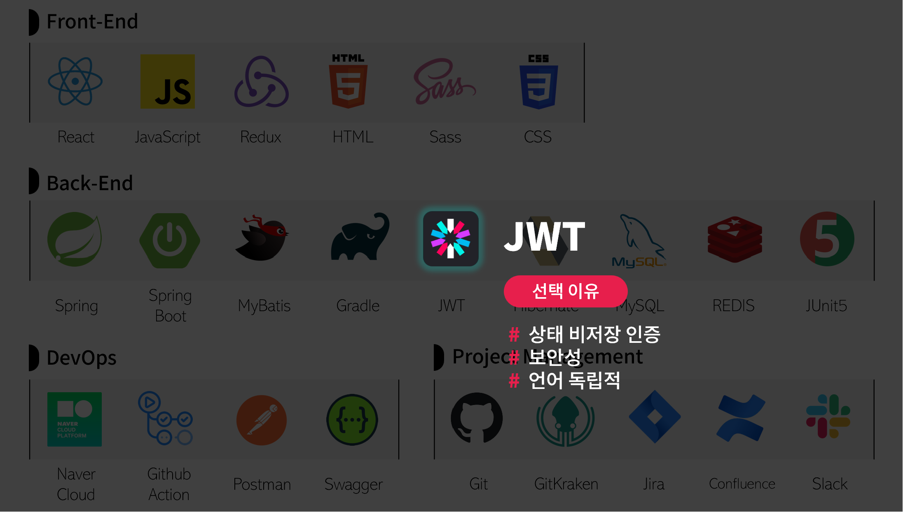
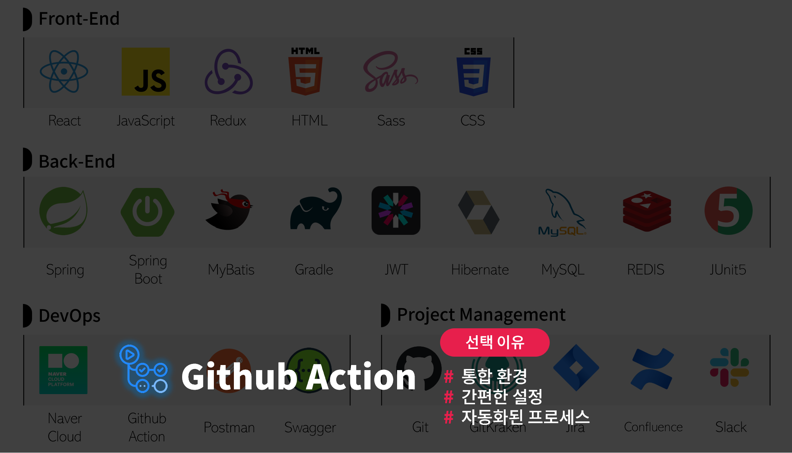

# CherryMarket-BE

## 🔎 서비스 개요

**🍒체리 마켓🍒**은 다양한 식품을 온라인으로 쉽게 구매할 수 있는 e-Commerce 웹 서비스입니다.

고객들은 맛과 품질에 중점을 둔 광범위한 식품 선택을 통해 쇼핑할 수 있으며, 키워드 검색 기능을 통해 원하는 상품을 빠르게 찾을 수 있습니다.

_(실제로 운영되는 서비스가 아닙니다.)_

---

## 📅 프로젝트 일정

- MVP: 2023.11.30 ~ 2023.12.26
  - 1차 스프린트 : 2023.11.30 ~ 2023.12.11
  - 2차 스프린트 : 2023.12.12 ~ 2023.12.18
  - 3차 스프린트 : 2023.12.19 ~ 2023.12.26

    
## 📚 프로젝트 아키텍처

## 📙 API 명세서

[더 자세한 API 문서 보러가기](http://docs.marketcherry.store/cherry-api-docs/dist/swagger-ui.html)

## 📗 DB ERD

---

## 🔧 기술 스택

### 📌 선택 이유

Spring Boot

- **의존성 관리**: 자동화된 의존성 관리를 통해 프로젝트 구성을 단순화
- **내장 서버**: 내장 서버 지원으로 별도 서버 설정 필요 없이 바로 개발 시작 가능
- **자동 구성**: 스프링의 다양한 기능을 자동으로 구성 빠른 개발 환경 조성

MyBatis

- SQL 익숙한 사용으로 러닝 커브 완화
- **SQL 제어**: SQL 개발자가 을 직접 작성하고 제어 가능

MySQL

- **신뢰성과 안정성**: 오랜 기간에 걸쳐 입증된 데이터베이스 관리 시스템
- **무료 오픈 소스**: 비용 효율적인 선택 개발 및 배포에 무료로 사용 가능
- **호환성과 확장성**: 다양한 언어 및 플랫폼과의 호환성 확장 가능한 구조

Redis

 - **빠른 성능**: 인메모리 데이터 스토어로 빠른 데이터 읽기 쓰기 속도 제공
 - **확장성**: 쉬운 스케일링 및 데이터 분산 처리 지원
 - **캐싱 및 세션 관리**: 효과적인 캐싱 솔루션 세션 관리 용이

JWT

- 상태 비저장 인증: 서버의 세션 관리 필요 없이 클라이언트 측에서 인증 관리
- 보안성: 정보의 암호화 및 서명을 통한 높은 보안성 제공
- 언어 독립적: 다양한 프로그래밍 언어 및 플랫폼에서 사용 가능

Swagger

- **API 문서 자동화**: REST API 문서를 자동으로 생성 및 관리
- **인터랙티브 테스팅**: API 엔드포인트에 대한 직접적인 테스트 지원
- **개발자 친화적**: UI API 직관적인 로 구조 이해 및 협업 용이
- **표준 준수**: OpenAPI , 사양 준수 다양한 플랫폼과의 호환성

GitHub Actions

- **통합 환경**: GitHub , CI/CD 저장소와 직접 통합되어 별도의 시스템 설정 불필요
- **간편한 설정**: YAML 파일을 통한 간단한 워크플로우 구성
- **자동화된 프로세스**: Push Pull Request , , 또는 시 자동화된 빌드 테스트 배포

